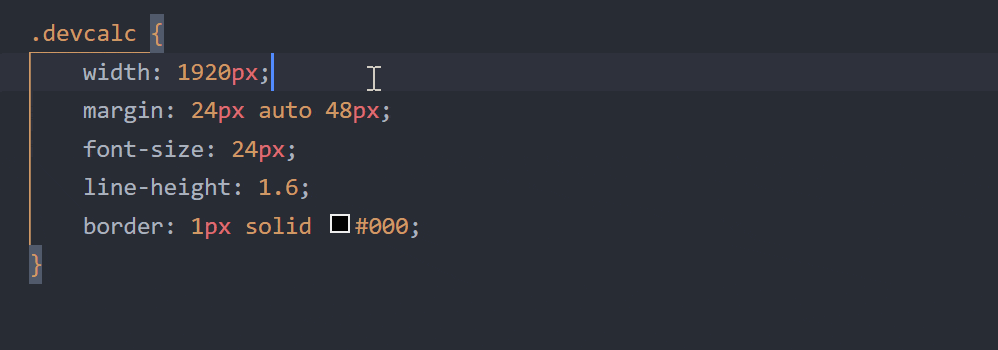

# DevCalc

[English](https://github.com/shenloong/vscode-devcalc/blob/main/README.md) | [中文](https://github.com/shenloong/vscode-devcalc/blob/main/README.zh.md)

在 VS Code 中实现 `px` 与 `vw/rem/rpx/%` 之间的相互转换。

## 特性

- **智能转换**：智能感知并实时转换输入中的 `px` 值。
- **单位换算**：在 `px` 与 `vw/rem/rpx/%` 间灵活转换。
- **转换范围**：支持选择只转换选中的值，或是所在行的所有值。
- **小数保留**：自定义保留小数的最大位数。
- **精度控制**：设置微小数值范围 `n`, 自动忽略 `-n ≤ px ≤ n` 的值。
- **注释辅助**：转换同时显示原 `px` 值的行注释。
- **悬停提示**：鼠标悬停显示转换公式。
- **快捷调整**：轻松调整屏幕宽度和根元素字号大小。
- **预设管理**：保存常用屏幕宽度，快速切换。
- **栏目定制**：自定义状态栏项的图标和位置。

## 用法

- 键入 `px` 值，自动完成 `vw/rem/rpx/%` 的转换结果。
- 按下 `Alt` + `Z` 执行单位转换。
- 按下 `Alt` + `Q` 或点击状态栏项以更新屏幕宽度或根元素字号大小。

## 语言模式

默认配置已涵盖以下语言模式，可根据需求添加或删除对应的语言标识符。

| 语言            | 标识符            |
| :------------- | :---------------- |
| HTML           | `html`            |
| CSS            | `css`             |
| SCSS           | `scss`            |
| Less           | `less`            |
| Vue            | `vue`             |
| JavaScript JSX | `javascriptreact` |
| TypeScript JSX | `typescriptreact` |
